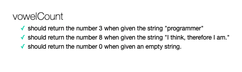

# Algorithms Practice

## Table of Contents

- [Description](#description)
- [Technology](#Technology)
- [Usage](#usage)
- [Contribution](#contribution)
- [Questions](#questions)

## Description:

This is my personal algorithms practice. Algorithms questions are from the coding bootcamp.

## Technology:

- Javascript
- Test.js
- HTML

## Usage

Check to see if your function works properly by opening test.html in web browser.

- Functions that pass the tests will be denoted with a green check mark.

- Functions that fail the tests will be denoted with a red x and an error message.

## Contribution

Algorithms questions: Trilogy Education Services.
Solutions: Wenwen Tian

## Questions?

Please feel free to contact me if you need any further information:

- [Email](mailto:wwtian9@gmail.com)
- [Github Profile](https://github.com/joce1ynn)
